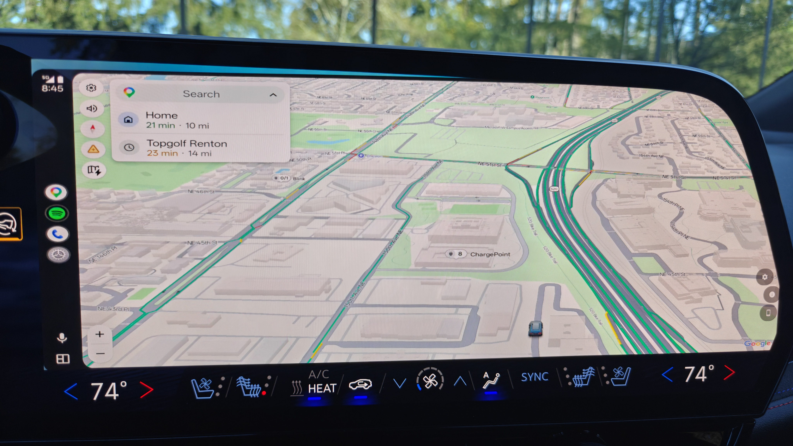

<p align="center">
  
</p>

# OpenAutoLink

> Wireless Android Auto for AAOS head units. No extra hardware.
>
> **⚠️ Under active development.** Core car connections and AA functionality are working. See [Known Issues](#known-issues) for current limitations.

[](https://github.com/mossyhub/openautolink/actions/workflows/ci.yml)
[](https://github.com/mossyhub/openautolink/releases/latest)

OpenAutoLink runs the full Android Auto protocol stack natively on an AAOS head unit using the [aasdk](https://github.com/opencardev/aasdk) C++ library via JNI. No SBC, no USB adapter, no extra hardware — the car and phone talk directly over WiFi.

<p align="center">
  
  <br>
  <em>Android Auto streaming wirelessly on a 2024 Chevrolet Blazer EV</em>
</p>

<p align="center">
  
  <br>
  <em>Google Maps displaying the car's EV battery level — real vehicle data forwarded through OpenAutoLink into Android Auto</em>
</p>

> **First-of-its-kind EV integration:** OpenAutoLink forwards real EV battery percentage, range, fuel type, and charge port data from the car into Android Auto. Google Maps uses this to show battery level alongside navigation — something no other aftermarket solution provides.

## Walkthrough

See the full installation and setup walkthrough video on YouTube:

[](https://www.youtube.com/watch?v=AmQOL05EM5k)

> **Discuss on XDA:** [OpenAutoLink — Wireless Android Auto for AAOS (GM EVs)](https://xdaforums.com/t/open-source-openautolink-wireless-android-auto-bridge-for-aaos-gm-evs.4785192/)

## Contents

- [Why This Exists](#why-this-exists)
- [How It Works](#how-it-works)
- [Features](#features)
- [What You Need](#what-you-need)
- [Quick Start](#quick-start)
- [Video and Display](#video-and-display)
- [Repository Layout](#repository-layout)
- [Documentation](#documentation)
- [Status](#status)
- [Known Issues](#known-issues)
- [Compatibility](#compatibility)
- [Acknowledgments](#acknowledgments)
- [License](#license)

## Why This Exists

Starting with the 2024 model year, GM dropped Apple CarPlay and Android Auto from its electric vehicles in favor of Google built-in infotainment. OpenAutoLink brings Android Auto back — the car app runs the AA protocol directly, connecting to the phone over WiFi with no intermediate hardware.

## How It Works

OpenAutoLink embeds the [aasdk](https://github.com/opencardev/aasdk) v1.6 C++ library directly into the AAOS app via JNI. The native layer handles the full AA protocol pipeline — SSL handshake, encryption, message framing, and channel multiplexing — while the Kotlin layer manages transport, video rendering, audio playback, and UI.

Two connection methods:

**Wireless (phone hotspot):** The user gets the car onto the phones wifi hotspot within the cars won Wifi setting pages. User presses Start on the phone companion app (or uses automatic modes available in the app). The companion app on the phone then starts mDNS and a TCP server. The OpenAutoLink car app finds the phones TCP server, connects then runs the AA session over that TCP connection.

**USB (AOA v2):** Plug the phone directly into the head unit's USB port. The app performs the Android Open Accessory handshake and runs the AA session over bulk USB endpoints. Not that you will get multiple USB access prompts every time. This is a GM bug.

```
┌─────────────────┐                              ┌──────────────────────────────┐
│   Android Phone  │                              │   Car Head Unit (AAOS)       │
│                  │                              │                              │
│  OAL Companion   │◀── Nearby (discovery) ─────▶│   Kotlin: transport, UI,     │
│  + phone hotspot │◀── WiFi (hotspot) ─────────▶│   video, audio, sensors      │
│  (wireless)      │◀── AA protocol (TCP) ──────▶│          ▼                    │
│                  │                              │   C++ JNI: aasdk v1.6        │
│         or       │                              │   SSL → Cryptor → Messenger  │
│                  │                              │   → AA channels              │
│  USB cable       │◀── AOA v2 (bulk USB) ──────▶│                              │
│  (direct)        │                              │                              │
└─────────────────┘                              └──────────────────────────────┘
```

## Features

- **Zero hardware (wireless)** — phone hotspot → car joins WiFi → AA over TCP, no cables or router needed
- **USB cable support** — AOA v2 direct connection for wired setups
- **aasdk v1.6 native protocol** — battle-tested C++ AA library via JNI, not a reimplementation
- **EV battery data in Android Auto** — battery %, range, fuel type, charge port forwarded from VHAL into AA. Google Maps shows battery level alongside navigation
- **H.264, H.265, and VP9** video with auto-negotiation. Up to 4K with AA Developer Mode
- **PCM and AAC-LC audio** — PCM for compatibility, AAC-LC for ~10× WiFi bandwidth reduction
- **Pixel-perfect display adaptation** — (Still a work in progress) auto-computed AA scaling for wide and ultra-wide AAOS screens to the full screen isused without stretching UI.
- **Per-purpose audio volume** — separate sliders for media, navigation, and assistant
- **Custom key remapping** — map any physical button to any AA action
- **Microphone enhancement** — NoiseSuppressor, AGC, AcousticEchoCanceler
- **Instrument cluster** — turn-by-turn navigation and media metadata on supported vehicles
- **Full sensor suite** — GPS, accelerometer, gyroscope, compass, EV energy model (21 sensor types)
- **Steering wheel controls** — media, voice, and DPAD forwarded to AA
- **Configurable display** — fullscreen/windowed, safe area insets, DPI, margins, scaling mode
- **Stats overlay** — codec, resolution, FPS, bitrate, WiFi band, decoder info
- **Automatic reconnect** — car sleep → wake → projection resumes with no user interaction
- **Built-in diagnostics** — USB device scanner, network probe, remote log server (TCP 6555), VHAL browser

## What You Need

| Item | Notes |
|------|-------|
| **AAOS vehicle** | Tested on 2024 Chevrolet Blazer EV. Other GM EVs likely work |
| **Android phone** | Running the OpenAutoLink Companion app |
| **Google Play Console account** | To publish the AAOS app to your car |

That's it. No SBC, no Ethernet adapter, no extra hardware.

### Phone Setup

Install the **OpenAutoLink Companion** app on your phone. It handles:
- Starting the TCP server for the head unit to discover and connect to automatically.
- Android Auto auto-start once TCP connection from the car is made.

You can either download a prebuilt APK from [GitHub Actions](https://github.com/mossyhub/openautolink/actions/workflows/build-companion.yml) (click the latest run → Artifacts → `companion-debug-apk`) or build it yourself from the `companion/` directory.

## Quick Start

### 1. Install the Companion App (Phone)

**Option A — Download prebuilt APK:**
1. Go to [Build Companion APK](https://github.com/mossyhub/openautolink/actions/workflows/build-companion.yml) on GitHub Actions.
2. Click the latest successful run.
3. Download the `companion-debug-apk` artifact.
4. Unzip and install the APK on your phone (enable "Install from unknown sources" if prompted).

**Option B — Build from source:**
```powershell
# Windows
cd companion
..\gradlew assembleDebug
adb install -r build/outputs/apk/debug/*.apk
```
```bash
# Linux / macOS
cd companion
../gradlew assembleDebug
adb install -r build/outputs/apk/debug/*.apk
```

The companion APK is signed with the Android debug key, which is fine for sideloading.

### 2. Build and Publish the Car App (AAOS)

Because this is an AAOS app, installation on the car goes through your own Google Play Console account:

1. Create a [Google Play Console](https://play.google.com/console/) developer account.
2. Create a new app and configure an AAOS release track.
3. Change the package name in `app/build.gradle.kts` from `com.openautolink.app` to your own unique ID.
4. Generate an upload keystore:
   ```powershell
   .\scripts\create-upload-keystore.ps1
   ```
5. Build and sign the release AAB:
   ```powershell
   # Windows (uses DPAPI-saved credentials)
   .\scripts\bundle-release.ps1
   ```
   ```bash
   # Linux / macOS (uses env-var credentials — see scripts/linux/README.md)
   export OAL_KEYSTORE_PASS='...'
   export OAL_KEY_PASS='...'
   scripts/linux/bundle-release.sh
   ```
6. Upload the AAB to Play Console, publish, and install on the car via Play Store.
7. Grant the **Car Information** permission: Settings → Apps → OpenAutoLink → Permissions.

### 3. Connect

**Wireless Hotspot (preferred method):**
1. **Turn on your phone's WiFi hotspot** (Settings → Hotspot / Tethering).
2. **Connect the car to the hotspot.** On the head unit, go to Settings → Network & Internet → WiFi and join the phone's hotspot network. The car needs an active WiFi connection to the phone before OpenAutoLink can stream.
3. Open the **Companion app** on the phone and tap **Start**.
4. Open **OpenAutoLink** on the car — the car app discovers the phones IP, connects via TCP, then the companion app starts AA directly pointing it to the car app through the existing WiFi connection over TCP.

> **Hotspot reconnect note:** When the car wakes from sleep, it should automatically rejoin the phone's hotspot — but in practice this can take 30+ seconds or occasionally fail to reconnect on its own. This appears to be a GM / AAOS WiFi behavior. If the car doesn't reconnect, toggle the phone hotspot off and back on, or manually reconnect from the car's WiFi settings. Once WiFi is back, OpenAutoLink should reconnect automatically if you have pressed the "Start" button or have one of the auto connect options configured.

**USB:**
1. Plug the phone into the head unit's USB port.
2. OpenAutoLink detects the device and performs the AOA v2 handshake.
3. Android Auto projection starts over the USB connection.

> **GM AAOS USB permission note:** On GM head units, the system will ask for USB connection permission every time you plug in, even if you check "Always allow." This is a known GM AAOS limitation — the permission preference is not persisted. There is no workaround; just tap Allow each time.

### 4. Recommended Settings

- **Uninstall or disable music apps on the head unit.** If Spotify, YouTube Music, or another music app is installed on both the AAOS head unit and the phone, media controls (steering wheel buttons, play/pause, skip) can get confused — the car may try to control the AAOS app and the AA app simultaneously. Uninstall or disable the AAOS versions (Settings → Apps) so media controls go exclusively to the phone's AA session.
- **Disable the car's "Hey Google" detection.** The AAOS built-in Google Assistant and Android Auto's assistant will both try to respond to "Hey Google," causing conflicts. Turn off "Hey Google" detection in the car's Settings → Google → Google Assistant. The steering wheel voice button will still trigger the car's built-in assistant (this can't be changed), but "Hey Google" will go exclusively to the AA session on the phone.
- You can either unpaid your phone entirely from the car BT, or what I do is leave it paired, but if you do: go into your phones BT setting for the car specific connection and toggle off Media and Phone Calls. those now flow through AA natively. leaving them on will cause GM's built in apps to take over rather than AA.

### Video and Display

## Resolution Tiers

| Resolution | Codec | Notes |
|-----------|-------|-------|
| 480p (800×480) | H.264 | Always available |
| 720p (1280×720) | H.264 | Always available |
| 1080p (1920×1080) | H.264, H.265, VP9 | Default tier |
| 1440p (2560×1440) | H.265, VP9 | Requires AA Developer Mode |
| 4K (3840×2160) | H.265, VP9 | Requires AA Developer Mode |

By default, the app uses auto-negotiation — the phone picks the best codec and resolution it supports.

## Display Adaptation

OpenAutoLink tries to auto-compute a good  scale for AA UI to use for your screen, but you will want to play with and adjust it for your cars screen. This can be done using the DPI setting in the app. this controls the scale of the AA UI. There is no way to directly tell AA what layout to use, but you will notice by making changes to the DPI there are certain scales at which AA will change the layout...so choose a scale that is visually good on your screen, but also makes AA choose the wide side-by-side layout vs portrait layout (maps is a single wide banner at the top).

> **Blazer EV tip:** Pull the top safe area inset down ~50px.

### Historical

The original architecture used an SBC (single-board computer) running a C++ bridge binary and Python Bluetooth/WiFi scripts to relay Android Auto from the phone to the car over Ethernet. That was replaced by direct mode. The app initially reimplemented the AA protocol in Kotlin, which was then replaced by the current aasdk C++ JNI approach for protocol correctness and performance. The bridge code is preserved on the [`bridge-mode`](https://github.com/mossyhub/openautolink/tree/bridge-mode) branch.

## Documentation

| Doc | Purpose |
|-----|---------|
| [Architecture](docs/architecture.md) | Component islands and system structure |
| [Embedded Knowledge](docs/embedded-knowledge.md) | Lessons from real-car testing — **read before touching video/audio/VHAL** |
| [USB Transport Plan](docs/usb-transport-plan.md) | AOA v2 design and implementation |
| [Local Testing](docs/testing.md) | Emulator testing, remote diagnostics, no-ADB debugging |
| [Wire Protocol](docs/protocol.md) | OAL protocol details (bridge-mode reference) |
| [Multi-Phone Plan](docs/multi-phone-nearby.md) | Multi-phone Nearby Connections design |
| [HUR Feature Comparison](docs/headunit-revived-feature-comparison.md) | Feature parity tracking vs Headunit Revived |

## Known Issues

- **H.265 video may appear green-tinted** on first connection for 30–45 seconds. May be Qualcomm-specific — not yet confirmed on other SoCs
- **Connection/Reconnecting** this is still buggy. sometimes it will just work, sometimes the app may freeze and require somewhat of a dance to get connected. WIP.

If you encounter other problems, please [open an issue](https://github.com/mossyhub/openautolink/issues).

## Compatibility

Validated on a **2024 Chevrolet Blazer EV** running AAOS 12L. Other GM EVs on similar AAOS platforms likely work but have not been broadly tested. Non-GM AAOS vehicles may have different restrictions.

The companion app runs on any Android phone with Google Play Services (Nearby Connections requires it).

## Acknowledgments

### Core Dependency

- **[opencardev/aasdk](https://github.com/opencardev/aasdk)** — The Android Auto protocol library at the heart of OpenAutoLink. Our [fork](https://github.com/mossyhub/aasdk) (branch `openautolink`) adds NavigationStatus extensions and EV energy model sensor types. The C++ library runs directly on the head unit via JNI.

### Where It Started

- **[metheos/carlink_native](https://github.com/metheos/carlink_native)** / **[lvalen91/carlink_native](https://github.com/lvalen91/carlink_native)** and the **[XDA CarLink thread](https://xdaforums.com/t/carlink.4774308)** inspired the original proof of concept.

### Projects I Learned From

- **[opencardev/openauto](https://github.com/opencardev/openauto)** — head unit emulator architecture.
- **[nickel110/WirelessAndroidAutoDongle](https://github.com/nickel110/WirelessAndroidAutoDongle)** — BT pairing and WiFi credential exchange reference.
- **[andrerinas/headunit-revived](https://github.com/nickel110/headunit-revived)** — AA receiver app reference for protocol implementation and feature ideas.

### On AI Assistance

This project is heavily AI-assisted, but grounded in extensive real hardware testing. The code moves faster with Copilot; the driveway testing, log analysis, and protocol debugging are what determine whether the result is actually good.

## License

TBD
