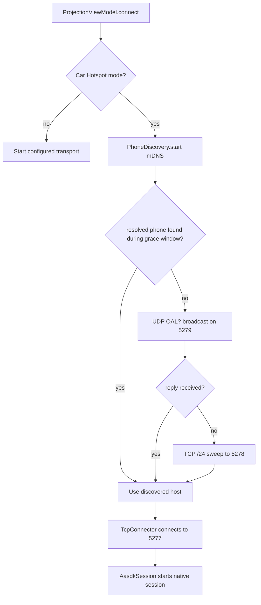
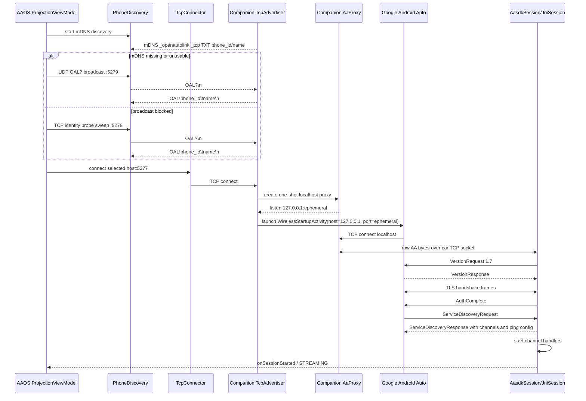
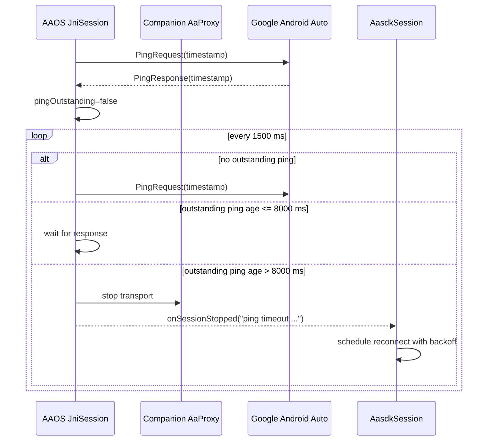
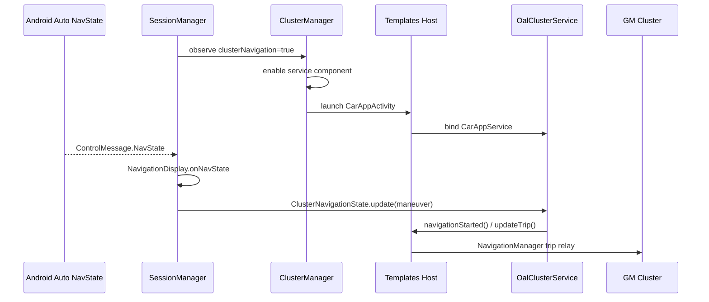

# OpenAutoLink Architecture

Last reviewed against code: June 19, 2026.

OpenAutoLink is currently a bridgeless AAOS projection stack. The AAOS app runs the Android Auto head-unit protocol through aasdk C++ in-process via JNI. The phone companion app does not decode or interpret Android Auto; it starts a local Android Auto wireless session on the phone and relays that byte stream to the car app.

The older SBC bridge and three-channel OAL protocol are not part of the active branch. See [protocol.md](protocol.md) only when working on historical bridge-mode code.

## Current Topology

```
Android phone                                      AAOS head unit
┌─────────────────────────────────────────┐        ┌──────────────────────────────────────┐
│ Google Android Auto / Gearhead          │        │ OpenAutoLink AAOS app                 │
│   connects to 127.0.0.1:<ephemeral>     │        │                                      │
│                 │                       │        │ PhoneDiscovery + TcpConnector         │
│                 ▼                       │        │   finds and dials phone:5277          │
│ OpenAutoLink companion                  │        │                 │                    │
│   CompanionService foreground service   │        │                 ▼                    │
│   TcpAdvertiser :5277                   │◄──────►│ AasdkTransportPipe                    │
│   Identity TCP :5278                    │        │                 │                    │
│   UDP discovery :5279                   │        │                 ▼                    │
│   mDNS _openautolink._tcp               │        │ JNI JniTransport + JniSession         │
│   AaProxy localhost bridge              │        │                 │                    │
└─────────────────────────────────────────┘        │ aasdk control/video/audio/etc.        │
                                                   │                 │                    │
                                                   │ SessionManager routes frames/events   │
                                                   └──────────────────────────────────────┘
```

The TCP socket between the apps is a single bidirectional AA byte pipe. Video, audio, touch, mic, navigation, media status, phone status, GNSS, IMU, and VHAL sensor data are multiplexed by the Android Auto protocol inside aasdk, not by OpenAutoLink JSON or custom media framing.

## Responsibilities

### AAOS App (`app/`)

| Area | Current code | Responsibility |
|------|--------------|----------------|
| Discovery | `transport/PhoneDiscovery.kt`, `transport/hotspot/TcpConnector.kt` | Finds a running companion with mDNS, UDP broadcast, TCP identity probes, gateway fallback, or manual IP. |
| AA transport | `transport/aasdk/AasdkSession.kt`, `AasdkTransportPipe.kt` | Wraps a connected `Socket` or USB pipe as blocking streams for native aasdk. |
| AA protocol | `app/src/main/cpp/jni_session.*`, `jni_channel_handlers.*`, `jni_transport.*` | Version exchange, TLS/auth, service discovery response, heartbeat, channel handling, JNI callbacks. |
| Session orchestration | `session/SessionManager.kt` | Connects transport output to video, audio, input, navigation, diagnostics, VHAL, GNSS, and IMU islands. |
| Media | `video/`, `audio/` | Decodes projected video, plays per-purpose audio, captures mic audio when requested. |
| Vehicle/input forwarding | `input/` | Sends touch, steering wheel, GNSS, IMU, and VHAL sensor data to the phone through aasdk. |

`AasdkSession.transportMode` supports `"hotspot"` and `"usb"` in code, but the app/companion workflow reviewed here is the TCP/hotspot path. USB transport code is planned but not yet implemented (no `transport/usb/` package exists in the current tree).

### Phone Companion (`companion/`)

| Area | Current code | Responsibility |
|------|--------------|----------------|
| Service lifecycle | `service/CompanionService.kt` | Foreground service, notification, wake lock, multicast lock, TCP advertiser startup, optional car WiFi helper. |
| TCP listener | `service/TcpAdvertiser.kt` | Listens on `0.0.0.0:5277`, publishes mDNS, answers identity probes, launches Android Auto. |
| Discovery identity | `CompanionPrefs`, `TcpAdvertiser` | Publishes stable `phone_id`, user-friendly name, and protocol version via mDNS TXT and identity responses. |
| Local AA proxy | `connection/AaProxy.kt` | Accepts Google AA on localhost and pumps bytes between the local AA socket and the car socket. |
| Car WiFi assist | `wifi/CarWifiManager.kt` | Optionally requests the car hotspot with `WifiNetworkSpecifier`; TCP remains bound to all interfaces. |
| Auto-start | `autostart/` | Starts the foreground service from configured Bluetooth, WiFi, or app-open triggers. |

The companion is deliberately dumb about Android Auto. It does not parse AA frames, make routing decisions for media channels, or inspect projected content.

## Discovery Pipeline

The car app prefers fresh discovery over cached IPs because car hotspots may hand out different subnets across boots.

1. `PhoneDiscovery.start()` begins Android NSD discovery for `_openautolink._tcp`.
2. On Android 14+, the app uses `NsdManager.registerServiceInfoCallback` to see all resolved addresses and prefer IPv4. Older versions fall back to `resolveService`.
3. If mDNS is slow or returns only unusable IPv6 link-local addresses, `udpBroadcastAllInterfaces()` sends `OAL?\n` to each usable `/24` broadcast address on UDP `5279`.
4. If broadcast fails, `startSweep()` probes each host in relevant `/24` networks on TCP `5278`.
5. A companion answers identity probes with `OAL!{phone_id}\t{friendly_name}\n`.
6. The selected phone host is passed to `TcpConnector`, which dials `host:5277`.

Manual IP mode bypasses discovery and makes `TcpConnector` retry only that host. It is useful for emulator or bench testing, but stale manual IPs can block fallback discovery.



This mirrors the Android NSD model: the platform discovers DNS-SD services with `discoverServices()` and resolves host/port details before connecting. See the official Android NSD guide: <https://developer.android.com/develop/connectivity/wifi/use-nsd>.

## App/Companion Handshake

There are two layers of handshake:

1. OpenAutoLink discovery and socket setup between the AAOS app and companion.
2. Android Auto protocol handshake between native aasdk on the AAOS app and Google Android Auto on the phone, carried through the companion proxy.



Important implementation details:

- `TcpAdvertiser` never reads from the `5277` AA stream before handing it to `AaProxy`; identity probing is isolated on `5278`.
- `AaProxy` is one-shot. If Android Auto reconnects, the companion rejects extra local AA sockets and the car establishes a fresh remote TCP session.
- The companion launch watchdog waits 8 seconds for Google AA to connect to the local proxy, retries the launch intent up to 3 times, then closes the car socket to force a clean reconnect.
- Native `JniSession` has a 15 second AA handshake watchdog. If streaming does not start, it aborts the transport so Kotlin reconnect logic can rebuild state.

## Heartbeat And Liveness

Three liveness mechanisms exist at different layers:

| Layer | Code | Behavior |
|-------|------|----------|
| Android Auto ping | `jni_session.cpp` | The service discovery response advertises `interval_ms=1500`, `timeout_ms=5000`, `tracked_ping_count=5`, `high_latency_threshold_ms=500`. After service handlers start, `JniSession` sends an initial ping and schedules pings every 1500 ms. |
| AA ping watchdog | `jni_session.cpp` | If a ping is outstanding for more than 8000 ms, `triggerAbort("ping timeout ...")` stops the transport and emits `onSessionStopped`. |
| TCP keepalive | `TcpConnector.kt` | Enables `SO_KEEPALIVE` and best-effort Linux TCP keepalive options: idle 5 s, interval 2 s, count 3, so ungraceful phone loss is noticed in roughly 10 s when supported. |

The phone may also send AA ping requests. `JniSession.onPingRequest()` echoes the timestamp in a `PingResponse`.



There is no legacy heartbeat-gated media write path in the active architecture. TCP flow control handles the app/companion byte pipe, and AA media acknowledgements are protocol-level channel flow control inside aasdk.

## Session State

`AasdkSession.connectionState` is intentionally coarse:

```
DISCONNECTED -> CONNECTING -> CONNECTED
```

`SessionManager` maps that to UI-facing states. `AasdkSession.onSessionStarted()` sets `CONNECTED` and emits `ControlMessage.PhoneConnected`; `SessionManager.handleControlMessage()` promotes the session to streaming when the phone-connected event arrives. Video and audio then flow through independent coroutines and dedicated dispatchers.

Unexpected stops go through `AasdkSession.onSessionStopped(reason)`:

- close the current `AasdkTransportPipe`
- emit `ControlMessage.PhoneDisconnected`
- if the user did not explicitly stop, restart the selected transport after backoff
- use longer backoff after aasdk protocol/handshake error 30, because the phone may still be tearing down an old TLS session

Sleep/wake recovery uses `SessionManager.forceReconnect()` paths and screen receiver state to avoid keeping stale sockets alive across AAOS suspend.

## Component Islands

The current islands still follow the original independence rule: public flows and callbacks are wired by `SessionManager`, not by cross-package shortcuts.

| Island | Package | Notes |
|--------|---------|-------|
| Transport | `com.openautolink.app.transport` | Discovery, TCP connector, aasdk session, optional USB/Nearby code. |
| Video | `com.openautolink.app.video` | `MediaCodecDecoder` consumes `VideoFrame` callbacks from aasdk. It waits for codec config/keyframes and can request IDR. |
| Audio | `com.openautolink.app.audio` | Per-purpose `AudioTrack` playback, AAC-LC decode, mic capture. |
| Input | `com.openautolink.app.input` | Touch scaling, steering wheel mapping, GNSS, VHAL, IMU, EV energy model sensors. |
| Navigation | `com.openautolink.app.navigation` | Maneuver state, icon rendering, cluster integration. |
| UI | `com.openautolink.app.ui` | Compose projection, settings, diagnostics, phone chooser. |
| Diagnostics | `com.openautolink.app.diagnostics` | In-app logs, telemetry, remote log server for no-ADB head units. |

## Cluster Navigation

Cluster navigation is an app-side AAOS integration, not part of the phone TCP pipe. Android Auto navigation messages arrive through aasdk, `SessionManager` converts them into `ManeuverState`, and the cluster service consumes the shared `ClusterNavigationState`.

The Settings → Features → Cluster Navigation toggle is authoritative:

| Toggle state | Behavior |
|--------------|----------|
| Enabled | `SessionManager` enables `OalClusterService`, launches `CarAppActivity` to trigger Templates Host binding on GM, and publishes current maneuvers into `ClusterNavigationState`. |
| Disabled | `ClusterManager` disables the service component, cancels pending binding/retry callbacks, clears cluster nav state, clears binding state, clears maneuver icon cache, and finishes the hidden `CarAppActivity` task if present. |



Both session paths share common state-collection and retry logic via `ClusterSessionDelegate`, which debounces `ClusterNavigationState.state` at 200ms and retries `navigationStarted()`/`updateTrip()` failures up to 3 times with 2s exponential backoff.

There are two service session paths:

| Path | Code | Purpose |
|------|------|---------|
| GM relay path | `ClusterMainSession` | Sends `NavigationManager.navigationStarted()` and `updateTrip()` immediately, because GM renders through its own OnStar turn-by-turn pipeline. |
| Standard AAOS path | `OalClusterSession` | Provides a `NavigationTemplate`/`RoutingInfo` screen for hosts that render the cluster template directly. |

Rebinding must preserve active route state. `ClusterManager.restartClusterBinding()` only tears down and relaunches the binding chain; it does not clear `ClusterNavigationState`. State is cleared only on phone disconnect, `NavStateClear`, session stop, or explicit feature disable.

The exported `OalClusterService` uses `HostValidator.Builder(this).build()`. This keeps normal Templates Host/system binders working through `android.car.permission.TEMPLATE_RENDERER` and rejects unknown third-party binders instead of accepting every host.

GM Templates Host also attempts to insert maneuver icons into `content://com.google.android.apps.automotive.templates.host.ClusterIconContentProvider`. Some GM builds include the class but do not register the provider, so debug builds register `ClusterIconShimProvider` under that authority for sideload validation. The provider is intentionally exported because Templates Host runs in another package. It implements the expected `insert()`, `query()`, and `openFile()` cache flow. Release builds must not declare this provider because Play requires provider authorities to be globally unique across developers, and this authority belongs to Google.

## External API Notes

- Android NSD is the supported platform mechanism for local DNS-SD discovery and resolution. OpenAutoLink uses `_openautolink._tcp` plus TXT attributes for stable phone identity. Official docs: <https://developer.android.com/develop/connectivity/wifi/use-nsd>.
- The companion uses a foreground service because keeping the phone-side listener and proxy alive is user-visible connection work. Android foreground services are required to show a notification. Official docs: <https://developer.android.com/develop/background-work/services/fgs>.
- `CarWifiManager` uses `WifiNetworkSpecifier`, which Android documents as the API for requesting a Wi-Fi network and, on supported devices, local-only concurrent connections. Official docs: <https://developer.android.com/reference/android/net/wifi/WifiNetworkSpecifier>.
- Nearby Connections remains in code as a legacy/alternate transport, but the companion no longer uses it. The companion UI forces transport mode to TCP.
