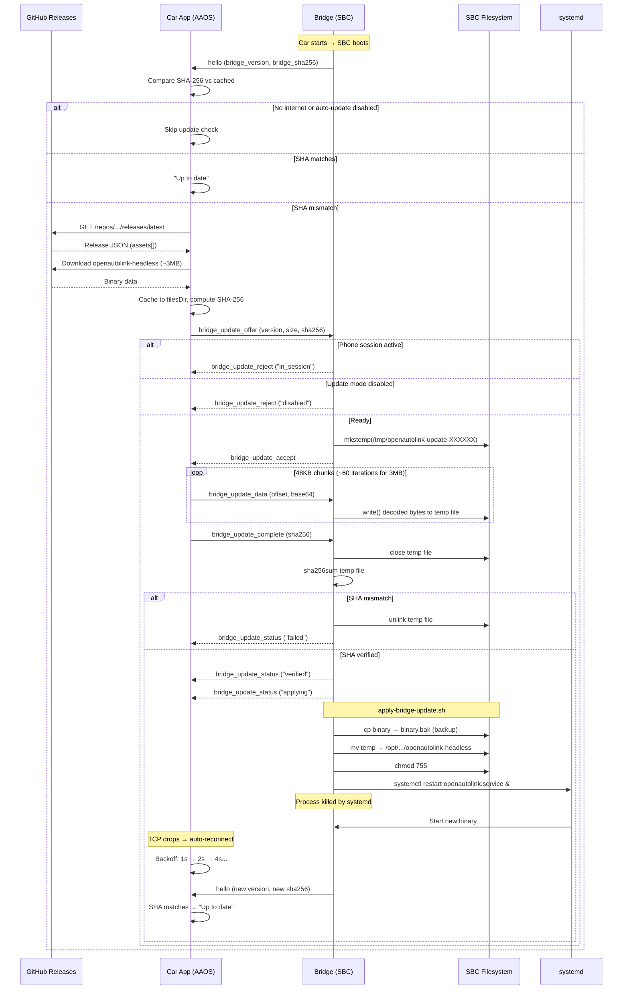
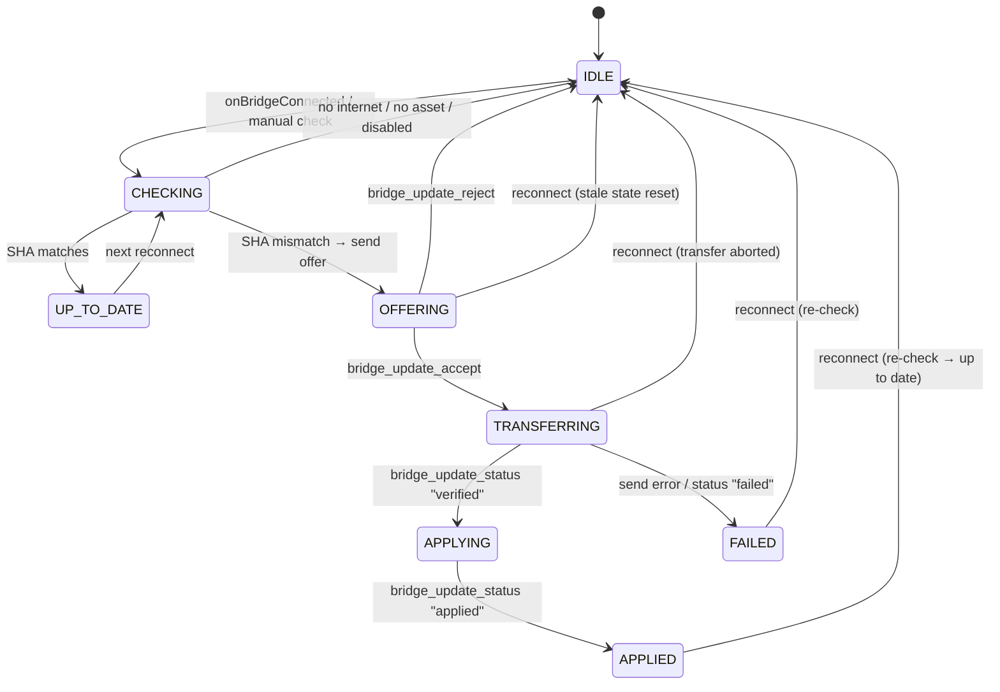

# Bridge OTA Update System — As-Built Documentation

> **Bridge-mode only.** This document describes the OTA update system for the
> SBC bridge binary. The current app/companion architecture does not use a
> bridge — the AAOS app runs aasdk natively via JNI. This document is preserved
> for the `bridge-mode` branch.

## Overview

The bridge binary (`openautolink-headless`) on the SBC is automatically updated by the car app over the existing OAL TCP control channel. This allows bridge-only releases without requiring users to rebuild their AAB or touch the SBC.



## Identity: SHA-256 vs Version String

The system uses **SHA-256 of the running binary** — not the version string — to decide if an update is needed. This is critical for developer workflows:

- A developer builds locally with version `dev` or `0.1.99` — arbitrary
- They deploy via SCP, iterate, test
- When they're done and re-enable auto-update, the SHA-256 of their local build won't match the GitHub release
- The app pulls the official binary and pushes it — bridge is back to the released version
- No version number coordination needed

The bridge computes its own SHA-256 at startup via `sha256sum /proc/self/exe` and caches it for the session.

## Components

### App Side

| File | Role |
|------|------|
| `app/.../transport/BridgeUpdateManager.kt` | Orchestrator: GitHub API check, download, chunk transfer, state machine |
| `app/.../transport/ControlMessage.kt` | Message types: `BridgeUpdateOffer`, `BridgeUpdateData`, `BridgeUpdateComplete`, `BridgeUpdateAccept`, `BridgeUpdateReject`, `BridgeUpdateStatus` |
| `app/.../transport/ControlMessageSerializer.kt` | JSON serialization/deserialization for update messages |
| `app/.../data/AppPreferences.kt` | `bridge_auto_update` (bool, default true), `github_repo_owner`, `github_repo_name` |
| `app/.../session/SessionManager.kt` | Creates `BridgeUpdateManager`, triggers check on hello, routes update responses |
| `app/.../session/BridgeInfo.kt` | Extended with `bridgeVersion` and `bridgeSha256` fields |
| `app/.../ui/settings/SettingsScreen.kt` | Bridge Updates section: toggle, version info, progress, history |
| `app/.../ui/settings/SettingsViewModel.kt` | Exposes update state, version, history to UI |

### Bridge Side

| File | Role |
|------|------|
| `bridge/.../headless_config.hpp` | `bridge_version` (from `OAL_BRIDGE_VERSION` compile define), `update_mode` (from env) |
| `bridge/.../CMakeLists.txt` | `OAL_BRIDGE_VERSION` cache variable, defaults to `"0.1.54"` |
| `bridge/.../oal_session.hpp` | `compute_binary_sha256()`, update handler declarations, update state fields |
| `bridge/.../oal_session.cpp` | `send_hello()` with version+SHA, `handle_bridge_update_offer/data/complete()`, base64 decode, SHA-256 verify |
| `bridge/.../main.cpp` | Reads `OAL_BRIDGE_UPDATE_MODE` from environment |
| `bridge/sbc/openautolink.env` | `OAL_BRIDGE_UPDATE_MODE=auto\|disabled` |
| `bridge/sbc/apply-bridge-update.sh` | Backup → swap binary → `systemctl restart openautolink.service` |
| `bridge/sbc/install.sh` | Downloads binary + apply script from GitHub Release on first install |

### CI/CD

| File | Role |
|------|------|
| `.github/workflows/release-bridge.yml` | Triggered on release publish. Cross-compiles ARM64, strips, uploads `openautolink-headless` to the release |
| `scripts/create-release.ps1` | Local alternative: creates GitHub Release with bridge binary from local WSL build |
| `scripts/build-bridge-wsl.sh` | WSL cross-compile, injects `OAL_BRIDGE_VERSION` from `secrets/version.properties` |

## Detailed Flow

### 1. Bridge Hello (every connect)

The bridge sends its version and SHA-256 in the hello message:

```json
{"type":"hello","version":1,"name":"OpenAutoLink","capabilities":["h264","h265"],
 "video_port":5290,"audio_port":5289,
 "bridge_version":"0.1.54","bridge_sha256":"a1b2c3d4e5f6..."}
```

`bridge_sha256` is computed once at first hello via `sha256sum /proc/self/exe` and cached.

### 2. App Check (automatic on connect)

`BridgeUpdateManager.onBridgeConnected()`:

1. Check `bridge_auto_update` preference — if false, stop
2. Call GitHub Releases API: `GET /repos/{owner}/{repo}/releases/latest`
3. Find asset named `openautolink-headless` in the release
4. Download to `context.filesDir/bridge_updates/openautolink-headless-{version}`
   - Cached: skips download if file exists and size matches
   - Old cached versions are cleaned up
5. Compute SHA-256 of downloaded file
6. Compare against `bridge_sha256` from hello
7. If match → "Up to date", done
8. If mismatch → proceed to offer

GitHub API is rate-limited to once per hour (cached `lastVersionCheckMs`).

### 3. Update Offer

App sends:
```json
{"type":"bridge_update_offer","version":"0.1.55","size":2845632,"sha256":"abc123..."}
```

Bridge checks:
- `update_mode == "disabled"` → reject with `"disabled"`
- Phone session active (`phone_connected_`) → reject with `"in_session"`
- Invalid size or SHA → reject with `"invalid_offer"`
- Otherwise → accept, create temp file via `mkstemp("/tmp/openautolink-update-XXXXXX")`

### 4. Binary Transfer

App streams in 48KB chunks (base64-encoded, ~65KB per JSON line):

```json
{"type":"bridge_update_data","offset":0,"length":49152,"data":"base64..."}
{"type":"bridge_update_data","offset":49152,"length":49152,"data":"base64..."}
...
```

- Throttled to 50ms between chunks (~1MB/s)
- Bridge writes each decoded chunk to the temp file via `write()`
- Progress reported to UI every 10 chunks

### 5. Verification

App sends:
```json
{"type":"bridge_update_complete","sha256":"abc123..."}
```

Bridge:
1. Closes temp file
2. Verifies file size matches expected
3. Runs `sha256sum` on temp file, compares to expected SHA
4. If mismatch → `bridge_update_status` with `"failed"`
5. If match → `chmod 755`, proceed to apply

### 6. Apply

Bridge sends status `"verified"`, then `"applying"`, then:

1. Sleeps 200ms (so status messages reach the app)
2. Runs `/opt/openautolink/bin/apply-bridge-update.sh /tmp/openautolink-update-XXXXXX &`

`apply-bridge-update.sh`:
1. Validates new binary is ELF format
2. Backs up current binary to `openautolink-headless.bak`
3. Moves new binary to `/opt/openautolink/bin/openautolink-headless`
4. Sets permissions (`chmod 755`)
5. Runs `systemctl restart openautolink.service &`

### 7. Reconnect

The service restart kills the bridge process. The app's existing auto-reconnect logic (exponential backoff: 1s → 2s → 4s → ... → 30s cap) handles reconnection. On reconnect, the new bridge sends hello with the updated version and SHA-256. The app sees it's now up to date.

## Robustness: TCP Drop Handling

The update flow is designed to never get stuck, even if TCP drops at any point.

### App State Machine



### TCP Drop Recovery

| Drop point | App behavior | Bridge behavior |
|---|---|---|
| During OFFERING (waiting for accept) | State reset to IDLE on reconnect | Temp file cleaned up in `on_app_disconnected()` |
| During TRANSFERRING (mid-chunk) | Transfer loop detects state ≠ TRANSFERRING, aborts. Job cancelled on reconnect | Temp file + fd cleaned up in `on_app_disconnected()` |
| After bridge_update_complete sent | State stuck briefly, reset on reconnect | If bridge verified before disconnect → applies anyway. If not → temp file cleaned up |
| After "applying" (bridge restarting) | TCP drops expected. Auto-reconnect finds new binary running | Bridge restarts via systemd with new binary |

### Key Invariants

- **Every state has an exit**: `onBridgeConnected()` resets stale APPLIED/FAILED/OFFERING to IDLE
- **Transfer is cancellable**: `transferJob` tracked separately, cancelled on reconnect or `cancel()`
- **Transfer loop guards**: checks `_updateState == TRANSFERRING` before each chunk; if state changed (reconnect reset it), loop exits
- **Bridge cleanup**: `on_app_disconnected()` closes any open temp file fd and unlinks the temp path
- **Version check cache cleared on reconnect**: ensures post-update reconnect re-checks and shows "Up to date"

## Security

| Layer | Protection |
|-------|------------|
| Download | HTTPS from GitHub (TLS-verified) |
| Integrity | SHA-256 verified by app before sending, verified again by bridge before applying |
| ELF check | `apply-bridge-update.sh` validates the file is an ELF binary |
| Write isolation | Binary written to `/tmp` first, only moved to install dir after verification |
| Backup | Previous binary saved as `.bak` before swap |
| Session safety | Updates rejected while a phone AA session is active |

Not implemented (future):
- Binary signing with a key baked into both app and bridge
- Rollback on failed boot (watchdog timer to restore `.bak`)

## Configuration

### Bridge Side (`/etc/openautolink.env`)

```bash
# auto (default) — accept OTA updates from the car app
# disabled — reject all update offers (for developers building locally)
OAL_BRIDGE_UPDATE_MODE=auto
```

### App Side (Settings → Bridge → Bridge Updates)

| Preference | Default | Effect |
|---|---|---|
| `bridge_auto_update` | `true` | When false, app does not check GitHub or offer updates |
| `github_repo_owner` | `mossyhub` | GitHub repository owner |
| `github_repo_name` | `openautolink` | GitHub repository name |

### Settings UI

The Bridge tab shows:

- **Auto-update toggle** — enable/disable
- **Bridge version** — currently running (from hello)
- **Latest release** — from GitHub API (highlighted if different from bridge)
- **Last checked** — relative timestamp
- **Status message** — color-coded (red=failed, blue=up-to-date, gray=in-progress)
- **Progress bar** — during checking/transferring
- **"Check for Update" button** — manual trigger
- **Update History** — last 10 events with timestamps

## Developer Workflow

Developers building locally:

1. Set `OAL_BRIDGE_UPDATE_MODE=disabled` in `/etc/openautolink.env` on the SBC
2. Optionally disable "Auto-update bridge binary" in app Settings
3. Build via WSL: `bash scripts/build-bridge-wsl.sh`
4. Deploy via SCP: `scripts/deploy-bridge.ps1`
5. Iterate freely — no auto-update interference

Local build identity:

- Local bridge binaries are compiled with version suffix: `X.Y.Z-local.<gitsha>`
- GitHub release bridge binaries keep plain semver: `X.Y.Z`
- `deploy-bridge.ps1` stamps `OAL_VERSION=X.Y.Z-local.<gitsha>` so bridge and BT logs clearly show local provenance
- App updater treats either `build_source=local` or `bridge_version` containing `-local.` as local/dev and skips auto-overwrite
- Manual **Check for Update** in Settings still overrides this guard and can intentionally install the GitHub release

When done:
1. Set `OAL_BRIDGE_UPDATE_MODE=auto` in env
2. Enable auto-update in app Settings
3. Next connect: SHA-256 mismatch detected → app pulls official GitHub release → pushes to bridge
4. Bridge is back to the released version

## Release Workflow

To publish a bridge update:

1. Push code, verify CI passes
2. Build AAB if app changes: `scripts/bundle-release.ps1`
3. Create GitHub Release: `gh release create v0.1.55 --title "v0.1.55" --notes "..."`
4. CI workflow builds ARM64 binary, strips it, attaches `openautolink-headless` to the release
5. If app changes: upload AAB to Play Console
6. All users' bridges update automatically on next car start

Bridge-only releases (no app changes) require only step 3 — zero user action.

## File Paths on SBC

| Path | Purpose |
|------|---------|
| `/opt/openautolink/bin/openautolink-headless` | Running binary |
| `/opt/openautolink/bin/openautolink-headless.bak` | Backup of previous version |
| `/opt/openautolink/bin/apply-bridge-update.sh` | Update apply script |
| `/etc/openautolink.env` | Configuration (includes `OAL_BRIDGE_UPDATE_MODE`) |
| `/tmp/openautolink-update-XXXXXX` | Temp file during transfer (cleaned up after apply) |

## Permissions

The app needs no additional Android permissions beyond what it already has:

| Operation | Permission | Status |
|-----------|------------|--------|
| Download from GitHub | `INTERNET` | Already declared |
| Cache to internal storage | None (app-private `filesDir`) | N/A |
| Push over TCP control channel | `INTERNET` | Already declared |

## Limitations

- **History is in-memory only** — resets on app restart. Sufficient for diagnostics but not persistent audit logging
- **No rollback** — if the new binary crashes on start, systemd will keep restarting it. The `.bak` file exists but no watchdog auto-restores it
- **Single binary** — only the C++ binary is updated. Python scripts (`aa_bt_all.py`), systemd services, and shell scripts are not updated via this mechanism (they change rarely and can be updated via re-running `install.sh`)
- **GitHub API rate limit** — unauthenticated requests limited to 60/hour per IP. One check per hour with caching keeps this well within limits
- **No delta updates** — full binary is transferred every time (~3MB). On local ethernet this takes <5 seconds
