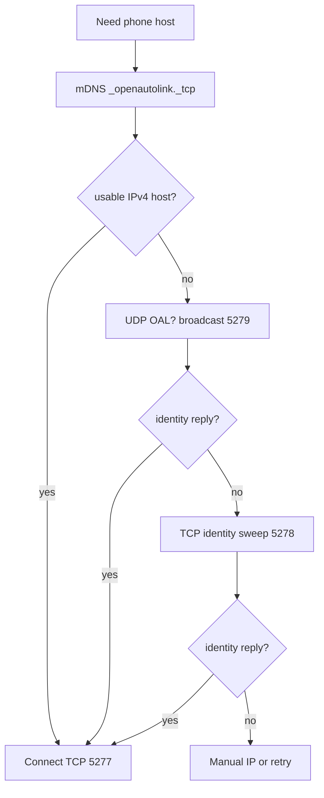
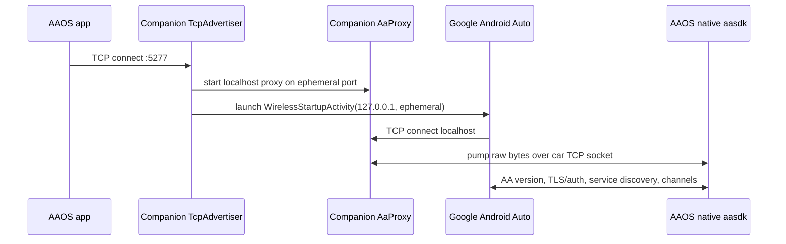

# OpenAutoLink Networking

Last reviewed against code: May 3, 2026.

This document describes the active AAOS app plus phone companion networking path. The historical SBC bridge used three TCP channels (`5288`, `5289`, `5290`) and is not active on this branch.

## Active Network Roles

```
                         shared local Wi-Fi network
          phone hotspot, car hotspot, or another AP that routes peers

┌──────────────────────────────────────┐      ┌───────────────────────────────────┐
│ Phone companion app                  │      │ AAOS OpenAutoLink app             │
│                                      │      │                                   │
│ :5277 TCP Android Auto byte pipe ◄───┼──────┤ TcpConnector dials phone:5277     │
│ :5278 TCP identity probe             │◄─────┤ PhoneDiscovery TCP sweep          │
│ :5279 UDP identity discovery         │◄─────┤ PhoneDiscovery UDP broadcast      │
│ _openautolink._tcp mDNS              │─────►│ PhoneDiscovery NSD listener       │
│                                      │      │                                   │
│ 127.0.0.1:<ephemeral> AaProxy ◄──────┤      │ native aasdk over connected pipe  │
│ Google Android Auto / Gearhead       │      │                                   │
└──────────────────────────────────────┘      └───────────────────────────────────┘
```

The car app always initiates the remote TCP connection to the companion. The companion listens on all interfaces, so it works whether the phone is the Wi-Fi AP, the car is the AP, or both devices are on another local network that permits peer traffic.

## Ports

| Port | Protocol | Owner | Purpose | Carries AA traffic? |
|------|----------|-------|---------|---------------------|
| `5277` | TCP | Phone companion `TcpAdvertiser` | Main bidirectional Android Auto byte pipe. The AAOS app connects here. | Yes |
| `5278` | TCP | Phone companion `TcpAdvertiser` | Short identity probe. Request `OAL?\n`; response `OAL!{phone_id}\t{friendly_name}\n`; close. | No |
| `5279` | UDP | Phone companion `TcpAdvertiser` | Broadcast discovery responder. Same request/response payload as `5278`. | No |
| `6555` | TCP | AAOS app diagnostics | Optional remote log server when enabled from diagnostics. | No |

`5288`, `5289`, and `5290` are bridge-mode/OAL-protocol ports only. They are not used by the current app/companion projection path.

## Discovery Order

The app avoids trusting old IP addresses because automotive Wi-Fi subnets can change across sleep/wake and ignition cycles.

```
1. mDNS / Android NSD
   service: _openautolink._tcp
   TXT: phone_id, friendly_name, version, proto

2. UDP broadcast
   car -> 255.255.255.255 or per-interface /24 broadcast, port 5279: OAL?\n
   phone -> car source port: OAL!phone_id<TAB>friendly_name\n

3. TCP identity sweep
   car -> each host in relevant /24, port 5278: OAL?\n
   phone -> car: OAL!phone_id<TAB>friendly_name\n

4. Gateway or manual IP fallback
   TcpConnector can connect to the Wi-Fi gateway in phone-hotspot cases or to a user-specified manual IP.
```

Android NSD is the preferred path because it is passive and uses the platform DNS-SD APIs. The UDP and TCP probes exist because some AAOS releases and APs return only IPv6 link-local NSD results or filter multicast. Official Android NSD documentation: <https://developer.android.com/develop/connectivity/wifi/use-nsd>.



## Connection Modes

### Car Hotspot Mode

The car provides the Wi-Fi network. The phone companion can optionally use `WifiNetworkSpecifier` to request the configured car SSID. `TcpAdvertiser` starts immediately on `0.0.0.0`; `CarWifiManager` is additive and only helps the phone join the network.

```
Car hotspot / AP
├── AAOS app joins as a client
└── Phone joins as a client
    └── companion listens on 5277/5278/5279
```

The AAOS app discovers the phone via mDNS, UDP broadcast, or sweep, then dials the phone's IP on `5277`.

### Phone Hotspot Mode

The phone provides the Wi-Fi network. The AAOS head unit joins it, and the phone is usually the DHCP gateway. `TcpConnector` can use gateway fallback to reach `5277`.

```
Phone hotspot / AP
├── phone companion listens on 5277/5278/5279
└── AAOS app joins as a client
    └── gateway IP usually points back to the phone
```

### Nearby Mode

Nearby Connections code still exists, but it is not the active companion workflow. `CompanionService` forces stale `TRANSPORT_NEARBY` preferences to TCP because the current GM AAOS path cannot rely on the required Nearby BT-to-Wi-Fi handoff permissions. If Nearby is re-enabled, use Google's stream payload and strategy docs as the source of truth:

- <https://developers.google.com/nearby/connections/android/exchange-data>
- <https://developers.google.com/android/reference/com/google/android/gms/nearby/connection/Strategy>

## TCP Session Setup



No OpenAutoLink application frame is placed on `5277`; it is raw AA protocol bytes after the TCP connection opens. This is why identity and diagnostics are separate ports.

## Liveness

OpenAutoLink uses both transport-level and protocol-level liveness:

- `TcpConnector` enables TCP keepalive and best-effort Linux socket options: idle 5 seconds, interval 2 seconds, count 3.
- `JniSession` advertises AA ping config in the service discovery response: interval 1500 ms, timeout 5000 ms, high latency threshold 500 ms, tracked ping count 5.
- `JniSession` sends pings every 1500 ms after service handlers start and aborts if a ping is outstanding for more than 8000 ms.
- If Google AA does not connect to the companion's local proxy within 8 seconds, the companion retries the launch intent up to 3 times, then closes the car TCP socket.
- If the AA protocol handshake does not reach streaming within 15 seconds, native code aborts the transport and Kotlin reconnects.

## Security And Scope

All projection traffic stays on the local network between the phone and car. The project does not add external network calls for projection. The main network exposure is the companion listening on all local interfaces while the foreground service is running. The listener is intentionally narrow:

- `5277` is accepted only as a one-shot AA stream for a car session.
- `5278` and `5279` return only the app-generated phone identity and friendly name.
- mDNS publishes the same local identity fields.

For development on GM head units with no ADB access, the AAOS app can expose a separate remote log server on `6555` only when the user starts it from diagnostics.
