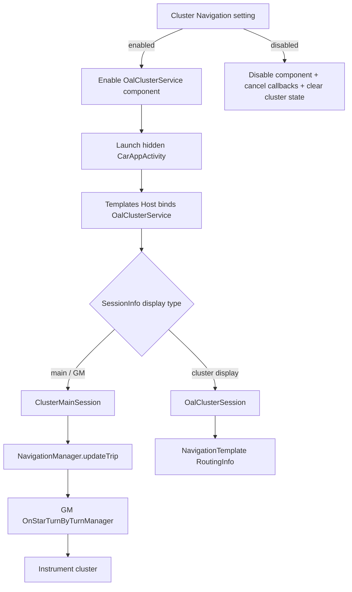

# Cluster Navigation Pipeline

**Device:** GM Info 3.7 (gminfo37)
**Platform:** Intel Apollo Lake (Broxton)
**Android Version:** 12 (API 32)
**Research Date:** January 2026

---

## Overview

This document describes how navigation turn-by-turn data flows from projection sources (CarPlay, Android Auto) and built-in navigation (Google Maps) to the vehicle instrument cluster display. The cluster shows basic directions including turn arrows, street names, and distance to the next turn.

---

## Key Finding: Text Metadata, NOT Video Stream

**GM AAOS does NOT use CarPlay's Alternate Video Stream for the instrument cluster.** Instead, it uses text-based metadata protocols:

| Source | Protocol | Data Type |
|--------|----------|-----------|
| CarPlay | iAP2 Route Guidance Display (RGD) | Text metadata |
| Android Auto | NavigationStateProto | Protobuf metadata |
| Google Maps | Android Car Navigation API | Structured data |

### Why Not Alternate Video?

1. **Cluster is a Separate ECU** - Connected via CAN bus (~500kbps), insufficient for video
2. **Local Rendering** - ClusterService.apk contains pre-rendered PNG icon assets
3. **Protocol Evidence** - libNmeIAP.so implements RGD (text), not video streaming

### What the Cluster Receives

```
Structured Data (NOT video frames):
├─ Maneuver Type (enum: turn_left, turn_right, roundabout, etc.)
├─ Distance to Next Maneuver (number + unit)
├─ Current Road Name (string)
├─ Next Road Name (string)
├─ Lane Guidance (array of lane states)
└─ Exit Information (optional string)
```

### How the Cluster Renders

ClusterService.apk renders navigation using **local PNG assets**:

```
/assets/Extended/C1/
├─ quick_turn_primary_maneuver.png
├─ quick_turn_secondary_maneuver.png
└─ lane_guidance_bg.png

/assets/Extended/C2/
├─ arrow_bg.png, arrow_bg_enhanced.png
├─ guidance_arrow_enhanced_small.png
├─ nav_distance_window.png
├─ nav_compass_window_small.png
├─ directions_sign.png
└─ carplay_icon.png
```

---

## Architecture Diagram

```
┌─────────────────────────────────────────────────────────────────────────────────┐
│                           NAVIGATION DATA SOURCES                                │
├──────────────────┬──────────────────┬────────────────────────────────────────────┤
│   Apple CarPlay  │   Android Auto   │         Built-In Google Maps               │
│   (iPhone)       │   (Phone)        │         (MapsCarPrebuilt.apk)              │
│                  │                  │                                            │
│   iAP2 Protocol  │   AAP Protocol   │   Android Car Navigation API               │
│   AirPlay Video  │   USB AOA        │   VMS Publisher/Subscriber                 │
└────────┬─────────┴────────┬─────────┴─────────────────┬──────────────────────────┘
         │                  │                           │
         ▼                  ▼                           ▼
┌─────────────────────────────────────────────────────────────────────────────────┐
│                      GM AAOS NAVIGATION SERVICES LAYER                           │
├─────────────────────────────────────────────────────────────────────────────────┤
│                                                                                  │
│  ┌─────────────────────┐   ┌─────────────────────────┐   ┌───────────────────┐  │
│  │ com.gm.carplay      │   │ CarService              │   │ Google Maps       │  │
│  │  .service.BINDER    │   │ (AAOS Framework)        │   │ (MapsCarPrebuilt) │  │
│  │ [ICarPlayService]   │   │ [car_navigation_service]│   │                   │  │
│  └──────────┬──────────┘   └───────────┬─────────────┘   └─────────┬─────────┘  │
│             │                          │                           │            │
│             ▼                          ▼                           │            │
│  ┌──────────────────────────────────────────────────────────────────────────┐   │
│  │           com.gm.server.NavigationService                                │   │
│  │           [gm.navigation.INavigationService]                             │   │
│  │           SELinux Context: gm_domain_service_nav                         │   │
│  └───────────────────────────────────┬──────────────────────────────────────┘   │
│                                      │                                          │
│                                      ▼                                          │
│  ┌──────────────────────────────────────────────────────────────────────────┐   │
│  │           gm.onstar.OnStarTurnByTurnManager                              │   │
│  │           [GMOnStarTBT.apk]                                              │   │
│  │           Turn-by-Turn Maneuver Processing                               │   │
│  └───────────────────────────────────┬──────────────────────────────────────┘   │
│                                      │                                          │
└──────────────────────────────────────┼──────────────────────────────────────────┘
                                       │
                                       ▼
┌─────────────────────────────────────────────────────────────────────────────────┐
│                         CLUSTER DISPLAY LAYER                                    │
├─────────────────────────────────────────────────────────────────────────────────┤
│                                                                                  │
│  ┌──────────────────────────────────────────────────────────────────────────┐   │
│  │           clusterService                                                  │   │
│  │           [gm.cluster.IClusterHmi]                                       │   │
│  │           Package: com.gm.cluster (PID 2094)                             │   │
│  │           Framework: info3_cluster.jar                                    │   │
│  │           APK: ClusterService.apk (2.9 MB)                               │   │
│  └───────────────────────────────────┬──────────────────────────────────────┘   │
│                                      │                                          │
│                                      ▼                                          │
│  ┌──────────────────────────────────────────────────────────────────────────┐   │
│  │           Vehicle Panel Service (HAL)                                     │   │
│  │           vendor.gm.panel@1.0::IPanel                                    │   │
│  │           Binary: /vendor/bin/hw/vehiclepanel                            │   │
│  │           Interface: IPanel/default, IPanelDiagnostics/default           │   │
│  └───────────────────────────────────┬──────────────────────────────────────┘   │
│                                      │                                          │
└──────────────────────────────────────┼──────────────────────────────────────────┘
                                       │
                                       ▼ (CAN Bus / Internal Bus)
                          ┌────────────────────────────┐
                          │   INSTRUMENT CLUSTER       │
                          │   (Separate ECU)           │
                          │   Turn Arrow + Distance    │
                          └────────────────────────────┘
```

---

## Data Flow by Source

### 1. CarPlay Navigation Data Flow

**Protocol:** iAP2 Route Guidance Display (RGD) - **Text Metadata, NOT Video**

> **Important:** CarPlay's Alternate Video Stream is NOT used for the cluster. GM uses the iAP2 Route Guidance Display (RGD) protocol which transmits text metadata only.

```
iPhone Navigation App (Apple Maps, Google Maps, Waze)
    ↓ iAP2 RGD Protocol (metadata only)
libNmeIAP.so (2.9 MB)
    ├─ RouteGuidanceDisplayComponent
    ├─ OnRouteGuidanceUpdate()
    ├─ OnRouteGuidanceManeuverUpdate()
    └─ OnLaneGuidanceInformation()
    ↓
com.gm.carplay.service.BINDER [ICarPlayService]
    ↓
com.gm.server.NavigationService [INavigationService]
    ↓
OnStarTurnByTurnManager (maneuver extraction)
    ↓
clusterService [IClusterHmi] → renders with local PNG assets
    ↓
vehiclepanel (vendor.gm.panel@1.0)
    ↓
Instrument Cluster ECU
```

**Key Files:**
| File | Path | Purpose |
|------|------|---------|
| libNmeIAP.so | /system/lib64/ | iAP2 protocol + RGD handling |
| libNmeNav.so | /system/lib64/ | Navigation command handling |
| libNmeNavCopier.so | /system/lib64/ | Navigation data buffering |
| libNmeCarPlay.so | /system/lib64/ | AirPlay video (main screen only) |

**iAP2 RGD Metadata Fields (from libNmeIAP.so):**
```
NMEMETANAME_IAP_RGD_MAX_CURRENT_ROAD_NAME_LENGTH
NMEMETANAME_IAP_RGD_MAX_AFTER_MANEUVER_ROAD_NAME_LENGTH
NMEMETANAME_IAP_RGD_MAX_MANEUVER_DESCRIPTION_LENGTH
NMEMETANAME_IAP_RGD_MAX_LANE_GUIDANCE_DESCRIPTION_LENGTH
NMEMETANAME_IAP_RGD_MAX_LANE_GUIDANCE_STORAGE_CAPACITY
NMEMETANAME_IAP_RGD_MAX_GUIDANCE_MANEUVER_CAPACITY
NMEMETANAME_IAP_RGD_MAX_DESTINATION_NAME_LENGTH
```

**RGD Callback Functions:**
- `OnRouteGuidanceUpdate()` - Route state changes
- `OnRouteGuidanceManeuverUpdate()` - Maneuver list updates
- `OnLaneGuidanceInformation()` - Lane guidance data
- `StartRouteGuidanceUpdates()` / `StopRouteGuidanceUpdates()`

**CarPlay Mode Tracking (from libNmeCarPlay.so):**
```
screen=%s(%s), main_audio=%s(%s), speech=%s, phone=%s, turn_by_turn=%s
```
Note: `turn_by_turn` is tracked separately from `screen` (main video), confirming they are different data channels.

### CINEMO Secondary Video Capability (Not Used for Cluster)

While libNmeNav.so contains secondary video APIs, these are **NOT used** for the cluster:

```cpp
// Present in binary but NOT used for cluster display:
NmeNavCommands::SetSecondaryVideo()
NmeNavCommands::GetSecondaryVideoAttributes()
```

The cluster receives text metadata via RGD, not video frames.

---

### 2. Android Auto Navigation Data Flow

**Protocol:** Android Auto Protocol (AAP) over USB AOA

```
Phone Navigation App (Google Maps/Waze)
    ↓ AAP USB/WiFi
CarService (AAOS Framework)
    ├─ car_navigation_service (enabled)
    ├─ CAR_NAVIGATION_MANAGER permission
    └─ NavigationStateProto (protobuf format)
    ↓
com.gm.server.NavigationService [INavigationService]
    ↓
OnStarTurnByTurnManager
    ↓
clusterService [IClusterHmi]
    ↓
vehiclepanel
    ↓
Instrument Cluster ECU
```

**Key Permissions (from privapp-permissions-car.xml):**
```xml
<permission name="android.car.permission.CAR_DISPLAY_IN_CLUSTER"/>
<permission name="android.car.permission.CAR_NAVIGATION_MANAGER"/>
<permission name="android.car.permission.CAR_INSTRUMENT_CLUSTER_CONTROL"/>
```

---

### 3. Built-In Google Maps Navigation

**Package:** `com.google.android.apps.maps` (MapsCarPrebuilt.apk)

```
Google Maps (MapsCarPrebuilt)
    ├─ CAR_NAVIGATION_MANAGER permission
    ├─ VMS_PUBLISHER / VMS_SUBSCRIBER
    └─ CAR_DISPLAY_IN_CLUSTER permission
    ↓
CarService → car_navigation_service
    ↓
com.gm.server.NavigationService
    ↓
clusterService
    ↓
vehiclepanel
    ↓
Instrument Cluster ECU
```

**Google Maps Permissions (from privapp-permissions-car.xml):**
```xml
<privapp-permissions package="com.google.android.apps.maps">
    <permission name="android.car.permission.CAR_DISPLAY_IN_CLUSTER"/>
    <permission name="android.car.permission.CAR_NAVIGATION_MANAGER"/>
    <permission name="android.car.permission.VMS_PUBLISHER"/>
    <permission name="android.car.permission.VMS_SUBSCRIBER"/>
</privapp-permissions>
```

---

## Key Components

### Navigation Service

**Service Registration:**
```
com.gm.server.NavigationService: [gm.navigation.INavigationService]
SELinux Context: u:object_r:gm_domain_service_nav:s0
```

The dedicated SELinux context (`gm_domain_service_nav`) separate from other GM services indicates it's a privileged navigation component with specific access policies for interfacing with both projection services and the cluster subsystem.

---

### OnStar Turn-by-Turn Manager

**Location:** `/system/priv-app/GMOnStarTBT/GMOnStarTBT.apk`

**Service Registration:**
```
gm.onstar.OnStarTurnByTurnManager
SELinux Context: u:object_r:gm_domain_service:s0
```

This APK is the **central hub** for all turn-by-turn navigation data, regardless of source:
1. Receives navigation data from all sources (CarPlay, Android Auto, Google Maps)
2. Processes maneuver information (turn direction, distance, street names)
3. Sends formatted turn-by-turn data to the cluster via clusterService

---

### Cluster Service

**Service Registration:**
```
clusterService: [gm.cluster.IClusterHmi]
Process: com.gm.cluster (PID 2094, system user)
```

**Framework Components:**

| File | Path | Purpose |
|------|------|---------|
| info3_cluster.jar | /system/framework/ | Cluster framework library |
| ClusterService.apk | /system/priv-app/ClusterService/ | Cluster display service (2.9 MB) |
| info3_cluster_library.xml | /system/etc/permissions/ | Framework declaration |

**Power Save Configuration:**
```xml
<!-- /system/etc/sysconfig/com.gm.cluster.powersave.xml -->
<config>
    <allow-in-power-save package="com.gm.cluster" />
</config>
```

---

### Vehicle Panel HAL

**Service:** `vendor.gm.panel@1.0-service`
**Binary:** `/vendor/bin/hw/vehiclepanel`

**Interfaces:**
- `IPanel/default` - Main panel control
- `IPanelDiagnostics/default` - Diagnostic interface

---

## Navigation Data Formats

### Android Auto NavigationState (Protobuf)

| Field | Description |
|-------|-------------|
| road_name | Current road name |
| next_instruction | Upcoming maneuver |
| distance_to_next | Distance to next turn |
| turn_icon | Maneuver icon type (left, right, roundabout, etc.) |
| lane_guidance | Lane guidance data |

### CarPlay Navigation (iAP2 Route Guidance Display)

CarPlay uses the **iAP2 Route Guidance Display (RGD)** protocol - a text-based metadata protocol, NOT the Alternate Video Stream.

**RGD Data Structure:**

| Field | Max Length | Description |
|-------|------------|-------------|
| Current Road Name | Configurable | Street currently on |
| After Maneuver Road Name | Configurable | Street after next turn |
| Maneuver Description | Configurable | Turn instruction text |
| Lane Guidance | Array | Lane recommendation states |
| Destination Name | Configurable | Final destination |
| Guidance Maneuver List | Capacity limit | Upcoming maneuvers |

**Protocol Flow:**
```
iPhone App → iAP2 RGD Message → libNmeIAP.so
    → OnRouteGuidanceManeuverUpdate()
    → Extract: maneuver_type, distance, road_names
    → NavigationService → ClusterService
    → Render using local PNG assets
```

**Why RGD Instead of Alternate Video:**
1. Lower bandwidth - CAN bus to cluster ECU is ~500kbps
2. Local rendering - Consistent look with vehicle cluster design
3. Reliability - Text survives connection hiccups better than video
4. Battery - Less processing on iPhone

---

## NavSens Integration (GPS/Location)

The Harman NavSens daemon provides location data that feeds into navigation:

**Service:** `vendor.harman.navsens@1.0-service`
**Config:** `/vendor/etc/navsens_config.json`

**Data Pipelines:**
```
ublox_uart → ubx_to_genivi → genivi_to_carplay → gm_gnss_hal
                    ↓
            genivi_to_sensors → gm_misalignment_correction → sensors_hal
```

**IPC Channel:** `/dev/ipc/ipc4` for real-time sensor data

**Pipeline Configuration (from navsens_config.json):**
```json
{
    "producer": "com.harman.navsensd.genivi_to_carplay",
    "consumer": "com.harman.navsensd.gm_gnss_hal",
    "variant": ["all"]
}
```

---

## VIP MCU Integration

The VIP MCU (Renesas RH850) coordinates cluster communication:

**Calibrations affecting cluster animation:**

| Calibration | Default | Purpose |
|-------------|---------|---------|
| cal_cluster_animation_ignore | 0 | Skip cluster animation sequence |
| cal_cluster_hmiready_ignore | 0 | Skip cluster HMI ready signal |

**VIP-to-SoC IPC Channels:**
- Channels 13-16: System state / Animation control

---

## Vehicle HAL Integration

**Android Automotive Vehicle HAL:**
```
android.hardware.automotive.vehicle@2.0-service-gm
User: vehicle_network
Interface: IVehicle/default
```

**GM Vehicle Extensions:**
- `vendor.gm.vehicle@1.0.so`
- `vendor.gm.panel@1.0.so` (Panel/Cluster display)

---

## Complete Service Map

| Service | Interface | Purpose |
|---------|-----------|---------|
| clusterService | gm.cluster.IClusterHmi | Cluster HMI display |
| com.gm.server.NavigationService | gm.navigation.INavigationService | Navigation data routing |
| gm.onstar.OnStarTurnByTurnManager | OnStar TBT interface | Turn-by-turn processing |
| com.gm.carplay.service.BINDER | ICarPlayService | CarPlay integration |
| vehiclepanel | vendor.gm.panel@1.0::IPanel | Panel HAL bridge |
| navsens-hal-1_0 | INavsens@1.0 | Navigation sensors |

---

## APKs Consuming NavigationService

| APK | Purpose |
|-----|---------|
| info3.jar | Core GM Info3 framework - central navigation integration |
| VTTProxyServer.apk | Vehicle telematics proxy |
| GMOnStar.apk | OnStar services (includes TBT) |
| GMAlexa.apk | Alexa voice assistant integration |
| GMTCPS.apk | Telematics services |
| GMTrustedDevice.apk | Trusted device management |
| DelayedWKSApp.apk | Delayed workstation services |
| GMVAC.apk | Vehicle Audio Control |
| GMNotifications.vdex | Notification system |
| diagnostics_pci_impl.jar | PCI diagnostics |

---

## Component Hierarchy

```
┌─────────────────────────────────────────────────────────────────┐
│                    NAVIGATION INTERFACE LAYER                    │
├─────────────────────────────────────────────────────────────────┤
│  info3.jar                                                       │
│  └─ Defines: gm.navigation.INavigationService (AIDL interface)  │
└─────────────────────────────────────────────────────────────────┘
                              │
                              ▼
┌─────────────────────────────────────────────────────────────────┐
│                    NAVIGATION PROCESSOR                          │
├─────────────────────────────────────────────────────────────────┤
│  GMOnStarTBT.apk                                                 │
│  └─ Implements: gm.onstar.OnStarTurnByTurnManager               │
│  └─ Consumes: INavigationService                                │
│  └─ Produces: Cluster-formatted maneuver data                   │
└─────────────────────────────────────────────────────────────────┘
                              │
                              ▼
┌─────────────────────────────────────────────────────────────────┐
│                    CONSUMERS                                     │
├─────────────────────────────────────────────────────────────────┤
│  - GMAlexa.apk - Voice-based navigation queries                 │
│  - GMTCPS.apk - Telematics integration                          │
│  - GMAnalytics - Navigation usage tracking                      │
│  - ClusterService - Display on instrument cluster               │
└─────────────────────────────────────────────────────────────────┘
```

---

## Summary

The navigation-to-cluster pipeline in GM AAOS follows this chain:

1. **Source Layer:** CarPlay (iAP2 RGD), Android Auto (NavigationStateProto), or Google Maps
2. **Navigation Service:** `com.gm.server.NavigationService` receives navigation metadata
3. **TBT Manager:** `OnStarTurnByTurnManager` processes maneuvers
4. **Cluster Service:** `clusterService` renders using local PNG assets
5. **HAL Layer:** `vehiclepanel` (vendor.gm.panel@1.0) bridges to hardware
6. **Physical Layer:** CAN bus or internal bus to instrument cluster ECU

### Important Distinction

**Text Metadata, NOT Video:** The cluster does NOT receive video frames from CarPlay or Android Auto. It receives structured text data (maneuver type, distance, road names) and renders the display locally using pre-built icon assets in ClusterService.apk.

| What Cluster Receives | What Cluster Does NOT Receive |
|----------------------|------------------------------|
| Maneuver type enum | H.264 video frames |
| Distance as number | Map imagery |
| Road names as strings | CarPlay Alternate Video Stream |
| Lane guidance array | Real-time rendered graphics |

This architecture ensures consistent cluster appearance regardless of navigation source and works within the CAN bus bandwidth limitations (~500kbps) between the infotainment SoC and the cluster ECU.

---

## Binary Analysis Evidence

### libNmeIAP.so - Route Guidance Display Implementation

```bash
$ strings libNmeIAP.so | grep -i "RouteGuidance\|RGD"
```

**Key Findings:**
```
RouteGuidanceDisplayComponent
CinemoIAPRouteGuidance
INmeIAPRouteGuidance::OnRouteGuidanceUpdate
INmeIAPRouteGuidance::OnRouteGuidanceManeuverUpdate
INmeIAPRouteGuidance::OnLaneGuidanceInformation
StartRouteGuidanceUpdates
StopRouteGuidanceUpdates
NMEMETANAME_IAP_RGD_COMPONENT_NAME
NMEMETANAME_IAP_RGD_MAX_CURRENT_ROAD_NAME_LENGTH
NMEMETANAME_IAP_RGD_MAX_AFTER_MANEUVER_ROAD_NAME_LENGTH
NMEMETANAME_IAP_RGD_MAX_MANEUVER_DESCRIPTION_LENGTH
NMEMETANAME_IAP_RGD_MAX_LANE_GUIDANCE_DESCRIPTION_LENGTH
```

These are text field length constants and metadata callbacks - confirming RGD (text protocol), not video.

### libNmeCarPlay.so - Mode Tracking

```bash
$ strings libNmeCarPlay.so | grep "turn"
```

**Key Finding:**
```
screen=%s(%s), main_audio=%s(%s), speech=%s, phone=%s, turn_by_turn=%s
```

`turn_by_turn` is tracked as a separate boolean state from `screen`, proving they are independent data channels.

### libNmeNav.so - Secondary Video (Unused)

```bash
$ strings libNmeNav.so | grep -i "Secondary"
```

**Functions Present (but NOT used for cluster):**
```
NmeNavCommands::SetSecondaryVideo()
NmeNavCommands::GetSecondaryVideoAttributes()
NmeNavCommands::SetSecondaryAudio()
NmeNavCommands::GetSecondaryAudioAttributes()
```

While CINEMO framework supports secondary video streams, there is no evidence these are connected to the cluster display path. The cluster ECU is connected via CAN bus which cannot support video bandwidth.

### ClusterService.apk - Local Asset Rendering

```bash
$ unzip -l ClusterService.apk | grep -E "arrow|maneuver|nav"
```

**PNG Assets for Local Rendering:**
```
assets/Extended/C1/quick_turn_primary_maneuver.png
assets/Extended/C1/quick_turn_secondary_maneuver.png
assets/Extended/C2/arrow_bg.png
assets/Extended/C2/arrow_bg_enhanced.png
assets/Extended/C2/guidance_arrow_enhanced_small.png
assets/Extended/C2/nav_distance_window.png
assets/Extended/C2/nav_compass_window_small.png
assets/Extended/C2/directions_sign.png
assets/Extended/C2/carplay_icon.png
assets/Extended/HUD/navigation_icon.png
```

The cluster renders navigation using these pre-built icons based on the maneuver type received via metadata, not by displaying video frames.

---

## Data Sources

**ADB Enumeration (`/analysis/adb_Y181/`):**
- `dumpsys SurfaceFlinger`
- `dumpsys display`
- `service list`
- Process enumeration

**Extracted Partitions (`/extracted_partitions/`):**
- `/system/priv-app/GMOnStarTBT/` - Turn-by-turn processor
- `/system/priv-app/ClusterService/` - Cluster display service
- `/system/framework/info3.jar` - Navigation interface definitions
- `/system/framework/info3_cluster.jar` - Cluster framework
- `/product/etc/permissions/` - Permission declarations
- `/vendor/etc/navsens_config.json` - NavSens configuration

**Binary Analysis:**
- `strings` on libNmeIAP.so - Route Guidance Display protocol
- `strings` on libNmeNav.so - Secondary video APIs (unused for cluster)
- `strings` on libNmeCarPlay.so - Mode tracking (screen vs turn_by_turn)
- `unzip -l` on ClusterService.apk - PNG asset inventory
- SELinux context analysis from product_service_contexts

**Source:** `/Users/zeno/Downloads/misc/GM_research/gm_aaos/`

---

## Third-Party App Access to Cluster Navigation

### Direct Access: NOT Possible

Third-party apps **cannot** directly access the cluster navigation system due to permission restrictions:

```xml
<!-- Required permissions (signature|privileged protection level) -->
<permission name="android.car.permission.CAR_NAVIGATION_MANAGER" />
<permission name="android.car.permission.CAR_DISPLAY_IN_CLUSTER" />
```

These permissions require either:
- System signature (signed with platform key)
- Privileged app status (installed in `/system/priv-app/`)

### Indirect Access: Via Templates Host (Car App Library)

Third-party navigation apps **CAN** send navigation data to the cluster by using the **Android Car App Library** (`androidx.car.app`). The **Templates Host** (`com.google.android.apps.automotive.templates.host`) acts as the privileged intermediary.

```
┌─────────────────────────────────────────────────────────────────────────────────┐
│                    THIRD-PARTY NAVIGATION VIA CAR APP LIBRARY                    │
├─────────────────────────────────────────────────────────────────────────────────┤
│                                                                                  │
│  ┌────────────────────────────┐                                                 │
│  │ Third-Party Navigation App │                                                 │
│  │ (e.g., Sygic, TomTom)      │                                                 │
│  │                            │                                                 │
│  │ Uses: androidx.car.app    │                                                 │
│  │ Template: NavigationTemplate                                                 │
│  │ Category: FEATURE_CLUSTER  │                                                 │
│  └─────────────┬──────────────┘                                                 │
│                │ Car App Library IPC                                            │
│                ▼                                                                 │
│  ┌──────────────────────────────────────────────────────────────────────────┐   │
│  │  Templates Host (com.google.android.apps.automotive.templates.host)      │   │
│  │                                                                          │   │
│  │  Privileged Permissions:                                                 │   │
│  │  ├─ android.car.permission.CAR_NAVIGATION_MANAGER                       │   │
│  │  ├─ android.car.permission.CAR_DISPLAY_IN_CLUSTER                       │   │
│  │  └─ android.car.permission.TEMPLATE_RENDERER                            │   │
│  └───────────────────────────────────┬──────────────────────────────────────┘   │
│                                      │                                          │
│                                      ▼                                          │
│  ┌──────────────────────────────────────────────────────────────────────────┐   │
│  │  CarService → NavigationService → ClusterService → vehiclepanel HAL      │   │
│  └──────────────────────────────────────────────────────────────────────────┘   │
│                                                                                  │
└─────────────────────────────────────────────────────────────────────────────────┘
```

### Templates Host Permissions

From `/product/etc/permissions/com.google.android.car.templateshost.xml`:

```xml
<privapp-permissions package="com.google.android.apps.automotive.templates.host">
    <!-- To be able to display activities in the cluster -->
    <permission name="android.car.permission.CAR_DISPLAY_IN_CLUSTER" />

    <!-- To be able to show navigation state (turn by turn directions) in the cluster -->
    <permission name="android.car.permission.CAR_NAVIGATION_MANAGER" />

    <!-- To be considered a system-approved host -->
    <permission name="android.car.permission.TEMPLATE_RENDERER" />
</privapp-permissions>

<!-- Declare support for templated applications -->
<feature name="android.software.car.templates_host" />
```

### Car App Library API for Third-Party Apps

**1. Declare Cluster Support in Manifest:**

```xml
<service android:name=".MyNavigationCarAppService" android:exported="true">
    <intent-filter>
        <action android:name="androidx.car.app.CarAppService" />
        <category android:name="androidx.car.app.category.NAVIGATION"/>
        <category android:name="androidx.car.app.category.FEATURE_CLUSTER"/>
    </intent-filter>
</service>
```

**2. Use NavigationManager API:**

```kotlin
val navigationManager = carContext.getCarService(NavigationManager::class.java)

// Start navigation (gains cluster control)
navigationManager.navigationStarted()

// Send turn-by-turn data
val trip = Trip.Builder()
    .setCurrentRoad(roadName)
    .setDestination(destination)
    .addStep(step)  // Maneuver instructions
    .build()
navigationManager.updateTrip(trip)

// End navigation
navigationManager.navigationEnded()
```

**3. Handle Cluster Session Separately:**

```kotlin
override fun onCreateSession(sessionInfo: SessionInfo): Session {
    return if (sessionInfo.displayType == SessionInfo.DISPLAY_TYPE_CLUSTER) {
        ClusterSession()  // Simplified UI for cluster
    } else {
        MainDisplaySession()  // Full UI for main screen
    }
}
```

### Trip Data Structure

The `Trip` object contains structured navigation data:

| Component | Description |
|-----------|-------------|
| `Step` | Turn-by-turn instructions (maneuver type, distance) |
| `Destination` | Final destination information |
| `TravelEstimate` | ETA, remaining distance |
| `currentRoad` | Current road name |

### Cluster Display Limitations

Per Android Car App quality guidelines (NF-9):

- **Map tiles only:** Cluster should primarily show map tiles
- **Not all data displayed:** Turn-by-turn instructions, ETA cards may not show on all OEMs
- **Non-interactive:** No buttons or touch interaction on cluster
- **Dark theme required:** Must support dark-themed rendering

### Data Flow Summary

```
Third-Party App (Car App Library)
    ↓ NavigationManager.updateTrip(trip)
Templates Host (privileged)
    ↓ CAR_NAVIGATION_MANAGER permission
CarService → NavigationService
    ↓
OnStarTurnByTurnManager
    ↓
ClusterService (renders with local PNG assets)
    ↓
vehiclepanel HAL
    ↓
Instrument Cluster ECU
```

### OpenAutoLink Implementation Notes

OpenAutoLink uses the Car App Library path above, but the GM Templates Host binding has several practical requirements:

| Requirement | OpenAutoLink behavior |
|-------------|-----------------------|
| Host discovery | `ClusterManager` enables `OalClusterService` and launches hidden `androidx.car.app.activity.CarAppActivity` because GM Templates Host does not reliably auto-discover the service from only the manifest intent filter. |
| User control | The Settings → Features → Cluster Navigation toggle is the source of truth. Disabled means no `CarAppActivity` launch, disabled service component, cleared cluster state, and canceled binding callbacks. |
| Host validation | `OalClusterService` uses `HostValidator.Builder(this).build()`. This accepts system/privileged Templates Host callers through `android.car.permission.TEMPLATE_RENDERER` and rejects unknown third-party binders. |
| Rebinding | `restartClusterBinding()` preserves `ClusterNavigationState` so an active route is not blanked during GM session teardown/rebind. State is cleared only on projection disconnect, `nav_state_clear`, session stop, or explicit feature disable. |
| Retry behavior | `ClusterMainSession` and `OalClusterSession` retry failed `navigationStarted()` / `updateTrip()` calls up to 3 times with a 2 second delay, using the last still-current `ManeuverState`. |
| Icon decode cost | Base64 maneuver bitmap icons are cached in a small LRU-style in-memory cache and cleared with cluster/session lifecycle. Failed decodes fall back to bundled vector icons. |



#### GM Icon Provider Shim

GM Templates Host converts `CarIcon` maneuver images into content-provider backed URIs using:

```
content://com.google.android.apps.automotive.templates.host.ClusterIconContentProvider
```

On observed GM builds, the Templates Host contains the provider class but does not declare the provider authority in its manifest. The first failed insert causes the host to stop sending icons for the session. OpenAutoLink debug builds declare `ClusterIconShimProvider` with that exact authority and `android:exported="true"` so the cross-package host can call it during sideload validation. Release builds cannot declare this provider because Play rejects uploads that claim another developer's authority.

The shim implements the minimal observed contract:

| Method | Behavior |
|--------|----------|
| `insert()` | Stores PNG bytes keyed by `iconId`, returns a `content://.../img/<cacheKey>` URI. |
| `query()` | Returns `contentUri` and `aspectRatio` metadata for a requested `iconId`. |
| `openFile()` | Serves cached PNG bytes through a pipe. |

If APK install fails because the target system image already owns `com.google.android.apps.automotive.templates.host.ClusterIconContentProvider`, use a build without the debug shim; that means the system Templates Host image fixed the orphaned-provider issue.

#### Manual Validation

Use remote diagnostics or logcat with `tag=cluster`:

| Scenario | Expected result |
|----------|-----------------|
| Toggle off | `OalClusterService` component disabled, no `CarAppActivity` launch, no new cluster sessions, cluster state cleared. |
| Toggle on | Service enabled, `CarAppActivity` launches, Templates Host binds, `ClusterBindingState.sessionAlive=true`. |
| Active route rebind | Last maneuver remains in `ClusterNavigationState`; cluster should redraw after rebinding without waiting for a fresh phone nav event. |
| Nav clear | `navigationEnded()` is called and cluster state clears. |
| Icon flow | `ClusterIconShimProvider` logs `insert()`, `query()`, and `openFile()` when Templates Host requests maneuver icons. |

---

## Implications for Third-Party Development

### For CarPlay/Android Auto Implementation

1. **For Cluster Display:** Must implement iAP2 RGD protocol or Android NavigationStateProto to send maneuver metadata to the cluster - video streaming to cluster is not supported

2. **For Main Screen:** Video streaming (H.264 via AirPlay/AAP) is only for the main infotainment display, not the cluster

3. **Maneuver Icons:** The cluster will render its own icons from ClusterService.apk assets based on the maneuver type enum received - custom icons cannot be displayed

4. **Text Limits:** Road names and descriptions have maximum length limits defined by RGD metadata constants

### For Native Android Navigation Apps

1. **Use Car App Library:** Third-party navigation apps must use `androidx.car.app` with `NavigationTemplate`

2. **Declare FEATURE_CLUSTER:** Add `androidx.car.app.category.FEATURE_CLUSTER` to manifest

3. **Call navigationStarted():** Cluster display only available after calling `NavigationManager.navigationStarted()`

4. **Handle Separate Sessions:** Implement `onCreateSession(SessionInfo)` to handle cluster display separately

5. **Limited Control:** Cannot display custom icons or arbitrary graphics on cluster - only standard template elements

---

## References

### GM AAOS Research Data

**Source:** `/Users/zeno/Downloads/misc/GM_research/gm_aaos/`

- ADB enumeration data
- Extracted partitions (system, vendor, product)
- Binary analysis of NME libraries

### Android Car App Library Documentation

- [Build a navigation app | Android Developers](https://developer.android.com/training/cars/apps/navigation)
- [Instrument Cluster API | AOSP](https://source.android.com/docs/automotive/displays/cluster_api)
- [Navigation template | Cars](https://developer.android.com/design/ui/cars/guides/templates/navigation-template)
- [Car App Library fundamentals](https://developer.android.com/codelabs/car-app-library-fundamentals)
- [Car App Jetpack releases](https://developer.android.com/jetpack/androidx/releases/car-app)
