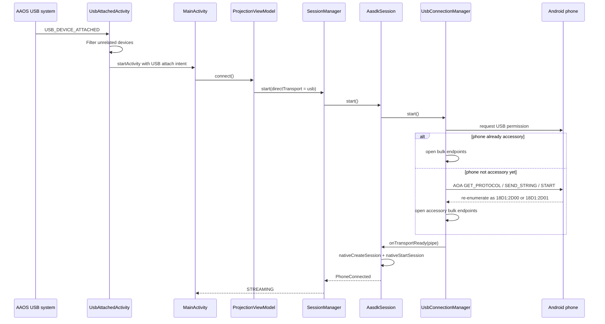
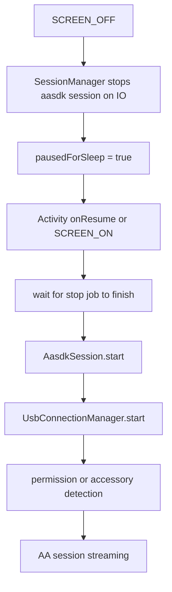

# USB Mode

> **Planned — not yet implemented.** The `transport/usb/` package does not exist
> in the current codebase. This document describes the design for a future USB
> AOA v2 transport. The current implementation supports WiFi transport only
> (Car Hotspot and Phone Hotspot modes).

Last reviewed against code: June 19, 2026.

OpenAutoLink plans to support a direct wired Android Auto transport over USB. In this mode the AAOS app would talk to the phone through Android Open Accessory v2 (AOA v2) and then feed that byte stream into the same native `aasdk` session used by the WiFi transports.

## Overview

USB mode exists so the head unit can run Android Auto without depending on the phone companion app, hotspot discovery, mDNS, or any other WiFi path.

Inline flow:

`phone attached -> permission -> AOA switch if needed -> accessory bulk endpoints -> AasdkTransportPipe -> JNI aasdk session`

## What USB Mode Does

- Uses the AAOS USB host APIs in the car app.
- Requests runtime USB permission for the attached phone.
- Switches a normal Android phone into accessory mode with AOA v2 control transfers when needed.
- Opens the accessory bulk IN/OUT endpoints.
- Wraps those endpoints as `InputStream` and `OutputStream` via `UsbTransportPipe`.
- Hands the stream pair to `AasdkTransportPipe`, then into the existing JNI `aasdk` stack.

## What USB Mode Does Not Use

- The phone companion app.
- mDNS, UDP identity probes, or TCP connection setup.
- Any custom USB framing above the AA protocol.

Once the bulk pipe is open, the rest of the stack is the same as hotspot mode: `aasdk` handles TLS, service discovery, channel multiplexing, ping, media, touch, mic, navigation, and sensors.

## Topology


## Key Components

| Component | File | Responsibility |
|------|------|----------------|
| Attach entrypoint | *(not yet implemented)* `transport/usb/UsbAttachedActivity.kt` | Would receive `USB_DEVICE_ATTACHED` intents and forward relevant devices to `MainActivity` when USB transport is selected. |
| Activity handoff | `app/src/main/java/com/openautolink/app/MainActivity.kt` | On attach intent, checks `directTransport == "usb"` and calls `ProjectionViewModel.connect()`. |
| Transport orchestration | *(not yet implemented)* `transport/usb/UsbConnectionManager.kt` | Would own attach/detach handling, permission requests, AOA switch, endpoint selection, device tracking, and UI-visible USB status. |
| AOA handshake | *(not yet implemented)* `transport/usb/UsbAccessoryMode.kt` | Would send `GET_PROTOCOL`, `SEND_STRING`, and `START` control transfers to enter accessory mode. |
| USB stream wrapper | *(not yet implemented)* `transport/usb/UsbTransportPipe.kt` | Would expose bulk endpoints as blocking streams for the native transport pipe. |
| Native AA transport | `app/src/main/java/com/openautolink/app/transport/aasdk/AasdkSession.kt` | Starts `aasdk` on top of the USB stream pair and handles reconnect/backoff. |
| Session orchestration | `app/src/main/java/com/openautolink/app/session/SessionManager.kt` | Maps USB transport state into app session state and handles sleep/wake recovery. |

## Connection Lifecycle



## AOA v2 Details

`UsbAccessoryMode` performs the standard accessory switch:

1. `GET_PROTOCOL (51)` verifies that the phone supports AOA.
2. `SEND_STRING (52)` sends the six accessory identity strings.
3. `START (53)` tells the phone to re-enumerate as a Google accessory.

The implementation appends the required trailing NUL byte to each accessory string before sending it. After `START`, `UsbConnectionManager` waits for the phone to disappear and come back as one of these Google accessory IDs:

- `0x18D1:0x2D00`
- `0x18D1:0x2D01`

## State Model

`UsbConnectionManager` exposes a coarse state machine for UI and diagnostics:

```text
IDLE
  -> DEVICE_DETECTED
  -> PERMISSION_REQUESTED
  -> SWITCHING_TO_ACCESSORY
  -> ACCESSORY_DETECTED
  -> CONNECTING
  -> CONNECTED
```

Important detail: `CONNECTED` here means the USB byte pipe is open and successfully handed to `AasdkSession`. The higher-level app session still transitions through `SessionManager` and only becomes streaming after the native AA session emits `PhoneConnected`.

## Device Filtering And Safety

The implementation deliberately avoids treating every USB event as a phone event.

- `UsbAttachedActivity` ignores unrelated attach intents before waking the app.
- `UsbConnectionManager` tracks the active USB device and ignores detach broadcasts from unrelated peripherals.
- The expected detach during the AOA re-enumeration step is ignored so the switch is not mistaken for a disconnect.
- Accessory endpoint selection prefers interface `0` for `0x2D01` accessory+ADB devices, which matches common AOA layouts.

This matters on AAOS head units because other peripherals may also enumerate on the system USB stack.

## Session Startup And Failure Handling

USB mode uses the same `AasdkSession` object as the WiFi transports, but the handoff has some USB-specific guardrails:

- `AasdkSession` rejects duplicate concurrent transport starts with `sessionStartInFlight`.
- `UsbConnectionManager` requires `onTransportReady()` to return success synchronously.
- If `nativeStartSession()` fails immediately, the USB connection manager closes the pipe and resets back to `IDLE` instead of being left stuck in a false connected state.

## Sleep/Wake And Reconnect

USB mode follows the same AAOS lifecycle rules as hotspot mode, but the reconnect path is simpler because there is no network rediscovery.



Current behavior:

- On sleep, `SessionManager` stops the AA session off the main thread to avoid ANRs.
- On wake, it waits for that stop job to finish before restarting the USB session.
- If the app focus loss closed only the video stream, video restart is deferred until the AA session is back in `CONNECTED` or `STREAMING`.

## UI And Diagnostics

USB mode is surfaced in three places:

- Settings: transport selector plus a USB status section.
- Projection HUD: active transport label and USB device description while idle, connecting, or error.
- Diagnostics: transport, USB status, and the currently tracked USB device description.

The USB status text comes from `UsbConnectionManager.status`, which is shared globally so the UI can observe the bring-up state from any screen.

## Constraints And Known Behavior

- USB mode is configured in the car app only.
- The wired path does not require the companion app for transport.
- Some AAOS implementations, especially GM, may show the USB permission dialog every time even when the user checks "Always allow".
- USB mode depends on the head unit port exposing USB host/device enumeration to AAOS.
- The emulator is not a meaningful USB validation environment; real-car testing is required.

## Related Docs

- [Architecture](architecture.md)
- [Embedded Knowledge](embedded-knowledge.md)
- [USB Transport Plan](usb-transport-plan.md)
